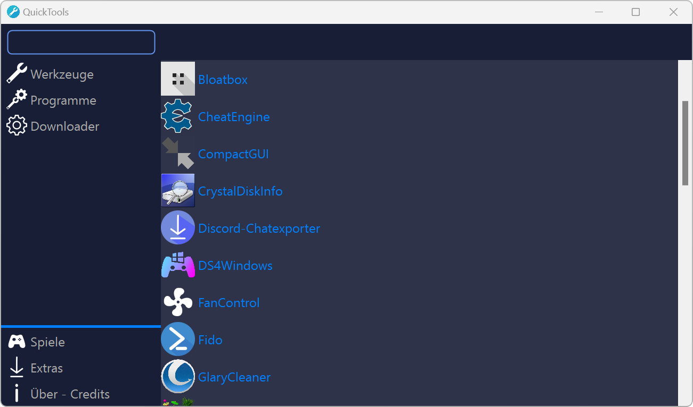

# QuickTools

**The publication should take place when .NET 7 comes out (November)**

**QuickTools** is a Portable Downloader for the programs which are already built in. You can download Youtube Videos, make your SaveGame (from a videogame) Portable and even update your Graphic Driver, but everything is made PORTABLE!

    
  </a>

## Features

- Download and start every program which is build in in Portable mode
- Base64 encrypt/decrypt
- Registry Hacks
- Energy options
- Portable Games
- Install applications

## Requirements

- Windows 10/11
- 200MB-2000MB free space (Depends on what you use)

## Supported languages

- English
- German
- Polish
